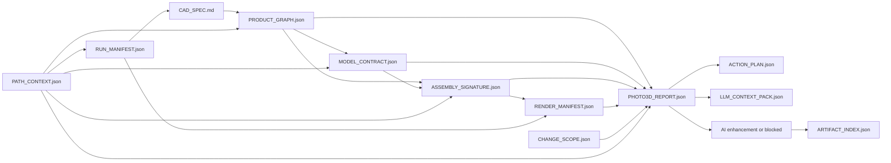

# 契约驱动照片级 3D 管线实施方案

> **给执行代理的要求**：按任务顺序执行。每个任务先写失败测试，再实现，再运行指定测试。实现时优先使用 `superpowers:subagent-driven-development` 或 `superpowers:executing-plans`。所有新增契约文件必须原子写入，所有用户可见输出使用中文。

## 目标

让 cad-spec-gen 对任意产品都能更稳定地产出照片级 3D 图。可靠性不靠人工肉眼对比某次渲染，也不靠针对单一产品或单一零件类型的临时修补，而靠贯穿 Spec、模型解析、装配、渲染和增强阶段的机器可读契约。

核心规则：

> 一张图不是因为生成成功就被接受，而是因为它能证明当前产品仍满足自己的产品契约、模型契约、装配签名、渲染清单和变更范围。

## 四角色审查结论与本版修改

### 系统架构师

1. 原方案没有明确 `PRODUCT_GRAPH.json` 的唯一数据来源。本版规定它只能由 `CAD_SPEC.md` 的 BOM、包络、渲染排除和装配约束解析器生成，下游不得再次重复解析产品身份。
2. 原方案允许从装配名称反推 `part_no`，身份链路脆弱。本版规定 `instance_id` 由产品图生成，并要求 `assembly.py` 的 `assy.add(..., name=...)` 使用该实例身份，不允许正式门禁依赖字符串反推。
3. 原方案缺少跨阶段哈希。本版让装配签名绑定产品图和模型契约，渲染清单再绑定装配签名、渲染配置、GLB、相机和输出文件哈希。
4. 原方案对缺失契约的失败语义不够清楚。本版定义缺失关键契约、静态预检代替运行时签名、渲染 stale、增强后几何漂移均为阻断项。

### 程序员

5. 原方案把 `MODEL_CONTRACT.json` 放在 `gen_std_parts.py` 内，覆盖面不足。本版新增统一 writer：`tools/model_contract.py`，由它合并解析器决策、自制件、用户 STEP、外部库和占位几何。
6. 原方案含有可能与现有代码不匹配的完整示例函数。本版把任务改成稳定接口、测试目标和接入点，避免把伪代码当成可直接提交的代码。
7. 原方案的 `MANUAL_LAYOUT_LOCK` 仍像临时开关。本版改为生成所有权契约：生成 scaffold 与人工 layout override 分离，`--force` 不越权，只有显式 `--force-layout` 才重建布局。
8. 原方案没有说明打包同步。本版要求新增工具进入 `hatch_build.py` / `scripts/dev_sync.py` 同步范围，避免源码可用但安装版缺文件。

### 3D 设计人员

9. 原方案只检查渲染文件存在。本版新增 `tools/render_qa.py`，检查分辨率、非空像素、主体占画面比例、裁切、透明/纯背景、视图数量和相机配置哈希。
10. 原方案未约束 AI 增强。本版规定增强前必须通过 CAD 层门禁，增强后必须进行边缘/轮廓一致性检查；不满足一致性的增强图只能作为预览，不能标记为通过。
11. 原方案没有记录材质和相机变化。本版将 `render_config_hash`、`camera_hash`、`material_config_hash` 写入渲染清单，防止旧图被误用。

### 机械设计师

12. 原方案只用 bbox 判断装配，不能代表机械合理性。本版把现有 `assembly_validator.py` 的 F1-F5 报告纳入装配签名，门禁阻断浮空、数量缺失、明显尺寸不匹配、异常质心和关键约束失败。
13. 原方案没有区分必需、可选、排除渲染的零件。本版在产品图中统一记录 `render_policy`、`required`、`visual_priority`、`change_policy`，门禁按策略处理。
14. 原方案没有漂移基准。本版引入 `CHANGE_SCOPE.json` 的 baseline 签名，漂移检查只与最近被接受的签名或用户指定基准比较，首轮出图只建立候选基准，不伪造历史稳定性。
15. 原方案没有容差来源。本版把默认容差写入 `pipeline_config.json`，并允许产品图或变更范围覆盖，但所有覆盖都会写入报告。

## 非目标

- 不让 AI 增强补齐 CAD 阶段缺失的零件、位置或结构。
- 不把某一类零件、某一个产品目录或某一次截图结果写进通用门禁。
- 不用生成文件 diff 作为正确性证据。
- 不让普通用户理解代码差异才能知道为什么被阻断。

## 临时收紧复盘与通用替代原则

前期执行中出现过一些“让当前样例看起来更对”的收紧动作。它们必须被视为反例：这类动作不能推广到其他产品、其他用户或其他模型来源，后续只能以契约、策略、配置和测试矩阵的形式进入系统。

| 临时收紧行为 | 为什么不通用 | 通用替代机制 |
|---|---|---|
| 根据某个设备、某类零件或某张 V1 图的问题写特判 | 其他产品的关键实例、视觉优先级和几何来源完全不同 | 只依据 `PRODUCT_GRAPH.instance_id`、`MODEL_CONTRACT`、`ASSEMBLY_SIGNATURE` 和 `RENDER_MANIFEST` 判定 |
| 通过文件名差集、默认目录或“最新 PNG”判断本轮渲染 | 覆盖同名文件、并发运行、跨项目缓存都会误判 | `run_id` + `ARTIFACT_INDEX.json` + 文件 hash + render_dir 路径锚定 |
| QA 失败只写日志或 manifest，但仍允许增强 | 空图、旧图或裁切图会被 AI 放大成看似照片级的错误结果 | QA 结果进入 `status/blocking_reasons`，增强、标注和交付必须消费门禁 |
| 靠装配对象名、顺序或字符串前缀反推零件身份 | 不同生成器、人工布局、外部 STEP 导入会改变命名 | `instance_id` 是唯一身份源；别名只能通过 `LAYOUT_CONTRACT.json` 显式映射 |
| 针对个别几何细节手工补模型 | 只能修一个案例，不能说明模型库覆盖率和质量 | 用 resolver adapter、参数化标准件、STEP 池、SolidWorks/Toolbox 导出和 A-E 质量等级统一闭环 |
| 为某个样例临时调阈值 | 阈值会变成隐藏产品假设，其他设备会误阻断或误通过 | 阈值进入 `pipeline_config.json`、`CHANGE_SCOPE.json` 或产品图策略，并写入报告 |
| 用户显式路径失败后 fallback 到默认路径 | 会拿到旧项目、旧 run 或错误子系统的产物 | 显式路径即强契约；缺 manifest、错 hash、错 subsystem 都阻断 |
| blocked 状态只留工程日志 | 非编程用户和大模型不知道下一步该补什么 | 写出 `PHOTO3D_REPORT.json`、`ACTION_PLAN.json` 和 `LLM_CONTEXT_PACK.json` |
| 源码工具更新后忘记同步安装版 data 镜像 | 本地能跑，安装版或其他项目缺工具 | packaging sync 测试强制 root 工具与 `src/cad_spec_gen/data` 镜像一致 |

后续每个实现 PR 都必须满足以下审查问题：

1. 这个判断是否依赖产品名、目录名、零件名、视图名或当前截图？如果是，必须改成契约字段或配置。
2. 这个阶段是否会扫描目录猜测最新产物？如果是，必须改为读取当前 `run_id` 的 `ARTIFACT_INDEX.json`。
3. 这个失败是否会被普通用户和大模型看见？如果不会，必须写入报告和动作计划。
4. 这个规则是否有至少一个不同产品/不同路径/不同 run 的负向测试？如果没有，不能认为通用。
5. 这个阈值是否可配置并写入报告？如果不能，不能作为正式门禁。

## 总体数据流



所有契约文件默认写入：

```text
cad/<subsystem>/.cad-spec-gen/
```

每次运行写入独立运行目录：

```text
cad/<subsystem>/.cad-spec-gen/runs/<run_id>/
```

渲染图和渲染清单默认写入：

```text
cad/output/renders/<subsystem>/<run_id>/
```

## 统一契约约定

### 原子写入与哈希

新增 `tools/contract_io.py`：

- `write_json_atomic(path, data) -> Path`
- `load_json_required(path, label) -> dict`
- `stable_json_hash(data) -> str`
- `file_sha256(path) -> str`
- `hash_existing_files(paths) -> dict[str, str]`

所有契约使用 `schema_version`、`generated_at`、`subsystem`、`source_paths`、`source_hashes`。哈希必须来自稳定 JSON 序列化或真实文件内容，不使用生成时间、绝对工作树路径或随机顺序作为签名输入。

### 路径与运行隔离

新增 `tools/path_policy.py`：

- `build_path_context(project_root, subsystem, output_dir=None, render_dir=None) -> dict`
- `strict_subsystem_dir(project_root, subsystem) -> Path`
- `project_relative(path, project_root) -> str`
- `canonical_compare_path(path) -> str`
- `assert_within_project(path, project_root, label) -> None`

硬规则：

- 正式 `photo3d` 不使用 `get_subsystem_dir()` 的模糊匹配；子系统目录必须与用户输入精确一致。
- 每次 `photo3d` 启动先生成 `run_id`，后续所有契约和产物都引用这个 `run_id`。
- 每个阶段只读取 `RUN_MANIFEST.json` 和 `ARTIFACT_INDEX.json` 登记的产物，禁止扫描目录猜最新文件。
- 用户显式传入图片目录、模型目录或 render 目录时，缺少 manifest 必须阻断，不能 fallback 到默认目录。
- 路径字段同时记录 `path_rel_project` 和 `path_abs_resolved`；哈希只使用内容和项目相对路径，报告展示可使用绝对路径。
- 所有文件读取前检查路径仍在 `project_root` 内；外部用户 STEP 先导入项目模型库，再进入契约。
- Windows 路径比较使用规范化路径，处理大小写、反斜杠、斜杠和符号链接差异。
- `DEFAULT_OUTPUT` 不作为长期缓存依据；命令运行时动态解析输出目录。

### 运行清单与产物索引

新增 `PATH_CONTEXT.json`：

```json
{
  "schema_version": 1,
  "subsystem": "demo_device",
  "requested_subsystem": "demo_device",
  "resolved_subsystem": "demo_device",
  "project_root": "D:/project",
  "cad_dir": "D:/project/cad",
  "subsystem_dir": "D:/project/cad/demo_device",
  "output_dir": "D:/project/cad/output",
  "render_dir": "D:/project/cad/output/renders/demo_device/run_20260503_010203",
  "skill_root": "D:/project",
  "env": {
    "CAD_PROJECT_ROOT": "",
    "CAD_OUTPUT_DIR": "",
    "BLENDER_PATH": ""
  },
  "path_context_hash": "sha256:..."
}
```

新增 `RUN_MANIFEST.json`：

```json
{
  "schema_version": 1,
  "run_id": "run_20260503_010203",
  "subsystem": "demo_device",
  "path_context_hash": "sha256:...",
  "command": "photo3d",
  "args": {
    "subsystem": "demo_device",
    "view": "V1"
  },
  "stages": [
    {"name": "product_graph", "status": "pass"},
    {"name": "render", "status": "blocked"}
  ],
  "artifacts": {}
}
```

新增 `ARTIFACT_INDEX.json`：

```json
{
  "schema_version": 1,
  "subsystem": "demo_device",
  "active_run_id": "run_20260503_010203",
  "accepted_baseline_run_id": "",
  "runs": {
    "run_20260503_010203": {
      "path_context": "cad/demo_device/.cad-spec-gen/runs/run_20260503_010203/PATH_CONTEXT.json",
      "product_graph": "cad/demo_device/.cad-spec-gen/runs/run_20260503_010203/PRODUCT_GRAPH.json",
      "render_manifest": "cad/output/renders/demo_device/run_20260503_010203/RENDER_MANIFEST.json",
      "photo3d_report": "cad/demo_device/.cad-spec-gen/runs/run_20260503_010203/PHOTO3D_REPORT.json"
    }
  }
}
```

`ARTIFACT_INDEX.json` 只做索引，不作为通过证据。每个被索引文件仍必须通过自身 hash 与上游契约 hash 校验。

### 模块导入隔离

新增 `tools/import_policy.py`：

- `load_module_from_path(path, module_prefix) -> module`
- `load_make_assembly(assembly_path) -> Callable`

硬规则：

- `assembly_validator.py` 不再通过 `sys.path.insert(0, sub_dir)` + `from assembly import make_assembly` 加载装配。
- 每个 subsystem 的 `assembly.py` 使用唯一 module name 从绝对路径导入，避免 Python 模块缓存污染。
- 连续验证多个 subsystem 时，第二个 subsystem 不得读取第一个 subsystem 的 `assembly` module。

### 大模型交互契约

新增 `ACTION_PLAN.json`：

```json
{
  "schema_version": 1,
  "run_id": "run_20260503_010203",
  "subsystem": "demo_device",
  "status": "blocked",
  "actions": [
    {
      "action_id": "rerun_render",
      "kind": "cli",
      "label_cn": "重新渲染当前装配",
      "command": "python cad_pipeline.py render --subsystem demo_device --view V1",
      "requires_user_input": false,
      "risk": "low"
    },
    {
      "action_id": "ask_for_model",
      "kind": "user_request",
      "label_cn": "请用户提供缺失零件的 STEP 文件",
      "requires_user_input": true,
      "risk": "medium"
    }
  ]
}
```

新增 `LLM_CONTEXT_PACK.json`：

```json
{
  "schema_version": 1,
  "run_id": "run_20260503_010203",
  "subsystem": "demo_device",
  "summary_cn": "照片级出图被阻断：当前渲染不属于本轮装配。",
  "blocking_reasons": ["render_stale"],
  "allowed_actions": ["rerun_render", "rerun_build", "ask_for_model"],
  "artifact_paths": {
    "photo3d_report": "cad/demo_device/.cad-spec-gen/runs/run_20260503_010203/PHOTO3D_REPORT.json",
    "action_plan": "cad/demo_device/.cad-spec-gen/runs/run_20260503_010203/ACTION_PLAN.json"
  }
}
```

大模型只能依据 `ACTION_PLAN.json` 中的动作建议执行修复；不能擅自扫描目录、猜测最新文件或跳过门禁。

### 实例身份规则

`PRODUCT_GRAPH.json` 是实例身份唯一来源。

规则：

- 每个可渲染 BOM 行按数量展开为实例。
- `instance_id = "<part_no>#<NN>"`，`NN` 从 `01` 开始，哪怕数量为 1 也保留后缀。
- `part_no` 表示零件定义，`instance_id` 表示装配实例。
- 生成的 `assembly.py` 必须使用 `assy.add(..., name=instance_id)`。
- 手工装配若使用别名，必须在 `LAYOUT_CONTRACT.json` 中提供 `assembly_name -> instance_id` 的一对一映射。
- 正式门禁不得从字符串前缀、后缀或 `STD-` 等命名风格反推身份。静态解析只能作为预检，不可作为通过依据。

## 契约文件

### `PRODUCT_GRAPH.json`

归属：Phase 1/spec，必要时由 codegen 在 CAD_SPEC 变化后刷新。

唯一数据来源：

- `codegen.gen_build.parse_bom_tree(CAD_SPEC.md)`：BOM、数量、自制/外购、父子层级。
- `codegen.gen_assembly.parse_envelopes(CAD_SPEC.md)`：包络尺寸和粒度。
- `codegen.gen_assembly.parse_render_exclusions(CAD_SPEC.md)`：排除渲染策略。
- `codegen.gen_assembly.parse_constraints(CAD_SPEC.md)`：装配约束。

示例：

```json
{
  "schema_version": 1,
  "run_id": "run_20260503_010203",
  "subsystem": "demo_device",
  "path_context_hash": "sha256:...",
  "source_spec": "cad/demo_device/CAD_SPEC.md",
  "source_hashes": {
    "CAD_SPEC.md": "sha256:..."
  },
  "parts": [
    {
      "part_no": "P-001",
      "name_cn": "主体件",
      "make_buy": "自制",
      "category": "structure",
      "quantity": 2,
      "required": true,
      "visual_priority": "hero",
      "render_policy": "required",
      "change_policy": "preserve",
      "bbox_expected_mm": [120.0, 80.0, 12.0],
      "parent_part_no": "A-001",
      "source_ref": "CAD_SPEC §5"
    }
  ],
  "instances": [
    {
      "instance_id": "P-001#01",
      "part_no": "P-001",
      "occurrence_index": 1,
      "parent_instance_id": "A-001#01",
      "required": true,
      "visual_priority": "hero",
      "render_policy": "required",
      "change_policy": "preserve"
    },
    {
      "instance_id": "P-001#02",
      "part_no": "P-001",
      "occurrence_index": 2,
      "parent_instance_id": "A-001#01",
      "required": true,
      "visual_priority": "hero",
      "render_policy": "required",
      "change_policy": "preserve"
    }
  ],
  "counts_by_part_no": {
    "P-001": 2
  },
  "constraints": [
    {
      "constraint_id": "C-001",
      "type": "contact",
      "instance_a": "P-001#01",
      "instance_b": "P-002#01",
      "required": true,
      "source_ref": "CAD_SPEC §9.2"
    }
  ]
}
```

策略枚举：

- `render_policy`: `required`、`optional`、`excluded`
- `visual_priority`: `hero`、`high`、`normal`、`low`
- `change_policy`: `preserve`、`may_refine_geometry`、`may_move`、`optional`

### `MODEL_CONTRACT.json`

归属：模型解析/代码生成阶段，由 `tools/model_contract.py` 统一写入。`codegen/gen_std_parts.py`、用户 STEP 导入、外部库解析、自制件生成器都只能提供决策输入，不能各自写不同口径的模型质量文件。

要求：

- 每个 `PRODUCT_GRAPH.parts` 中 `render_policy != "excluded"` 的 `part_no` 必须有一条模型决策。
- 无模型或只生成占位体也必须写入决策，不允许静默缺行。
- `geometry_quality` 用统一 A-E 评级。

质量语义：

- `A`: 用户或供应商 STEP、经过验证的外部模型，尺寸和外观均可信。
- `B`: 受控参数化模板，尺寸可用，外观对照片级渲染有帮助。
- `C`: 通用库或包络驱动近似体，可用于低优先级展示。
- `D`: 基础占位体，只允许低优先级且不作为照片级通过证据。
- `E`: 缺失、失败或无法加载。

示例：

```json
{
  "schema_version": 1,
  "run_id": "run_20260503_010203",
  "subsystem": "demo_device",
  "path_context_hash": "sha256:...",
  "product_graph_hash": "sha256:...",
  "decisions": [
    {
      "part_no": "P-001",
      "adapter": "step_pool",
      "geometry_source": "USER_STEP",
      "geometry_quality": "A",
      "validated": true,
      "requires_model_review": false,
      "review_reasons": [],
      "bbox_mm": [120.0, 80.0, 12.0],
      "origin_policy": "center_xy_bottom_z",
      "coordinate_frame": "product_mm",
      "scale_policy": "millimeter_no_scale",
      "source_path_rel_project": "parts_library/user/P-001.step",
      "source_path_abs_resolved": "D:/project/parts_library/user/P-001.step",
      "source_hash": "sha256:...",
      "dimensional_confidence": "high",
      "visual_confidence": "high"
    }
  ],
  "coverage": {
    "required_total": 12,
    "decided_total": 12,
    "missing_total": 0
  }
}
```

### `ASSEMBLY_SIGNATURE.json`

归属：build/assembly validation。正式签名必须来自运行 `make_assembly()` 后的 CadQuery Assembly，不接受仅靠源码静态解析通过。

要求：

- 读取 `PRODUCT_GRAPH.json`，用 `instance_id` 映射装配对象。
- 写入世界坐标 bbox、中心点、4x4 变换矩阵、父级、模型来源哈希。
- 写入 `ASSEMBLY_REPORT.json` 路径和哈希，将现有 F1-F5 检查纳入门禁。
- `source_mode = "runtime"` 才可通过照片级门禁。
- `source_mode = "static_preflight"` 只能提示可能缺少哪些实例，不可作为通过依据。

示例：

```json
{
  "schema_version": 1,
  "run_id": "run_20260503_010203",
  "subsystem": "demo_device",
  "path_context_hash": "sha256:...",
  "source_mode": "runtime",
  "product_graph_hash": "sha256:...",
  "model_contract_hash": "sha256:...",
  "assembly_report_path": "cad/demo_device/.cad-spec-gen/runs/run_20260503_010203/ASSEMBLY_REPORT.json",
  "assembly_report_hash": "sha256:...",
  "signature_hash": "sha256:...",
  "instances": [
    {
      "instance_id": "P-001#01",
      "part_no": "P-001",
      "parent_instance_id": "A-001#01",
      "bbox_world_mm": [120.0, 80.0, 12.0],
      "center_world_mm": [0.0, 0.0, 6.0],
      "transform_matrix": [
        [1.0, 0.0, 0.0, 0.0],
        [0.0, 1.0, 0.0, 0.0],
        [0.0, 0.0, 1.0, 0.0],
        [0.0, 0.0, 0.0, 1.0]
      ],
      "model_source_hash": "sha256:..."
    }
  ],
  "counts_by_part_no": {
    "P-001": 2
  },
  "critical_validator_issues": []
}
```

### `RENDER_MANIFEST.json`

归属：render。它必须证明图片来自当前装配，而不是旧目录中的 PNG。

示例：

```json
{
  "schema_version": 2,
  "run_id": "run_20260503_010203",
  "subsystem": "demo_device",
  "path_context_hash": "sha256:...",
  "render_dir_rel_project": "cad/output/renders/demo_device/run_20260503_010203",
  "product_graph_hash": "sha256:...",
  "model_contract_hash": "sha256:...",
  "assembly_signature_hash": "sha256:...",
  "assembly_signature_path": "cad/demo_device/.cad-spec-gen/runs/run_20260503_010203/ASSEMBLY_SIGNATURE.json",
  "render_config_hash": "sha256:...",
  "camera_hash": "sha256:...",
  "material_config_hash": "sha256:...",
  "glb_hash": "sha256:...",
  "render_script_hash": "sha256:...",
  "partial": false,
  "files": [
    {
      "view": "V1",
      "path_rel_project": "cad/output/renders/demo_device/run_20260503_010203/V1_front_iso.png",
      "path_abs_resolved": "D:/project/cad/output/renders/demo_device/run_20260503_010203/V1_front_iso.png",
      "sha256": "sha256:...",
      "width": 2048,
      "height": 2048,
      "qa": {
        "nonblank": true,
        "object_occupancy": 0.42,
        "cropped": false
      }
    }
  ]
}
```

### `CHANGE_SCOPE.json`

归属：当前用户请求或本轮 skill run。没有用户显式范围时使用保守默认。

示例：

```json
{
  "schema_version": 1,
  "run_id": "run_20260503_010203",
  "subsystem": "demo_device",
  "path_context_hash": "sha256:...",
  "intent": "提升照片级真实感",
  "baseline_run_id": "run_20260502_220000",
  "baseline_path_context_hash": "sha256:...",
  "baseline_product_graph_hash": "sha256:...",
  "baseline_model_contract_hash": "sha256:...",
  "baseline_assembly_signature_path": "cad/demo_device/.cad-spec-gen/runs/run_20260502_220000/ASSEMBLY_SIGNATURE.json",
  "baseline_assembly_signature_hash": "sha256:...",
  "allowed_part_nos": [],
  "allowed_instance_ids": [],
  "allowed_change_types": ["material_refinement"],
  "tolerances": {
    "bbox_size_abs_mm": 1.0,
    "bbox_size_rel": 0.03,
    "center_abs_mm": 1.0,
    "center_rel_of_assembly_diag": 0.01,
    "rotation_deg": 1.0
  },
  "forbidden_regressions": [
    "missing_required_instance",
    "unexpected_count_change",
    "unexpected_bbox_drift",
    "unexpected_transform_drift",
    "hero_quality_below_threshold",
    "render_stale",
    "enhancement_shape_drift"
  ]
}
```

首轮没有基准时：

- presence、count、model quality、validator、render QA 仍然必须通过。
- drift gate 写 warning：`no accepted baseline yet`。
- 通过后只写候选基准；需要 `photo3d --accept-baseline` 或后续明确流程把候选提升为 accepted。

### `PHOTO3D_REPORT.json`

归属：`photo3d` 门禁。它是普通用户的主要反馈文件。

示例：

```json
{
  "schema_version": 1,
  "run_id": "run_20260503_010203",
  "subsystem": "demo_device",
  "path_context_hash": "sha256:...",
  "status": "blocked",
  "ordinary_user_message": "照片级出图已停止：有必需实例未进入装配，且 V1 渲染不是当前装配生成的。",
  "blocking_reasons": [
    "required instance P-001#01 missing from runtime assembly",
    "render manifest assembly signature does not match current assembly"
  ],
  "warnings": [],
  "counts": {
    "product_instances": 18,
    "assembly_instances": 17,
    "render_files": 1
  },
  "artifacts": {
    "product_graph": "cad/demo_device/.cad-spec-gen/runs/run_20260503_010203/PRODUCT_GRAPH.json",
    "model_contract": "cad/demo_device/.cad-spec-gen/runs/run_20260503_010203/MODEL_CONTRACT.json",
    "assembly_signature": "cad/demo_device/.cad-spec-gen/runs/run_20260503_010203/ASSEMBLY_SIGNATURE.json",
    "render_manifest": "cad/output/renders/demo_device/run_20260503_010203/RENDER_MANIFEST.json",
    "action_plan": "cad/demo_device/.cad-spec-gen/runs/run_20260503_010203/ACTION_PLAN.json",
    "llm_context_pack": "cad/demo_device/.cad-spec-gen/runs/run_20260503_010203/LLM_CONTEXT_PACK.json"
  }
}
```

## 门禁语义

`tools/photo3d_gate.py` 必须按顺序执行以下检查。前置契约缺失时直接阻断，不进入增强。

1. 契约完整性：产品图、模型契约、运行时装配签名、渲染清单均存在且 schema version 支持。
2. 路径一致性：所有契约的 `run_id`、`subsystem`、`path_context_hash` 必须一致。
3. 哈希一致性：模型契约绑定当前产品图；装配签名绑定当前产品图和模型契约；渲染清单绑定当前装配签名。
4. 产物索引一致性：当前阶段只读取 `ARTIFACT_INDEX.json` 中当前 `run_id` 登记的产物。
5. 实例完整性：所有 `required=true` 且 `render_policy=required` 的实例必须出现在运行时装配签名。
6. 数量一致性：`counts_by_part_no` 必须匹配产品图，除非变更范围显式允许。
7. 模型质量：`hero` 至少 B，`high` 至少 C；D/E 不能作为照片级通过证据。
8. 机械合理性：本轮 `ASSEMBLY_REPORT.json` 中的关键失败进入阻断项。
9. 变更范围：未在 `allowed_part_nos` 或 `allowed_instance_ids` 中的实例，不允许超过 bbox、中心点或旋转容差。
10. 基准绑定：baseline 必须与当前项目、子系统、产品图和模型契约兼容。
11. 渲染新鲜度：渲染清单的装配、GLB、配置、相机和文件哈希必须匹配当前文件。
12. 渲染质量：所有目标视图必须通过 `render_qa` 的非空、分辨率、主体占比和裁切检查。
13. 增强一致性：增强图必须通过 CAD 渲染参考的边缘/轮廓一致性检查；失败时增强图保留为预览，但 `PHOTO3D_REPORT.status` 不得为 `pass`。
14. 动作计划：任何 blocked 状态必须写出 `ACTION_PLAN.json` 和 `LLM_CONTEXT_PACK.json`。

默认门禁配置写入 `pipeline_config.json`：

```json
{
  "photo3d_gate": {
    "hero_min_quality": "B",
    "high_min_quality": "C",
    "bbox_size_abs_mm": 1.0,
    "bbox_size_rel": 0.03,
    "center_abs_mm": 1.0,
    "center_rel_of_assembly_diag": 0.01,
    "rotation_deg": 1.0,
    "render_min_width": 1600,
    "render_min_height": 1600,
    "render_object_occupancy_min": 0.08,
    "render_object_occupancy_max": 0.92,
    "enhance_edge_similarity_min": 0.85,
    "strict_subsystem_match": true,
    "forbid_manifest_fallback": true,
    "require_run_scoped_artifacts": true
  }
}
```

## 普通用户的一键流程

命令：

```powershell
python cad_pipeline.py photo3d --subsystem <name>
```

默认执行：

1. 解析严格路径，生成 `PATH_CONTEXT.json` 和 `RUN_MANIFEST.json`。
2. 若产品图缺失或 CAD_SPEC 变化，在本轮 run 目录生成 `PRODUCT_GRAPH.json`。
3. 运行 codegen/build，生成或刷新模型契约和装配签名。
4. 运行 Blender 渲染，并写入 run-scoped `RENDER_MANIFEST.json`。
5. 运行 `photo3d_gate`。
6. 写出 `PHOTO3D_REPORT.json`、`ACTION_PLAN.json`、`LLM_CONTEXT_PACK.json`。
7. 只有门禁通过才运行增强后端。
8. 更新 `ARTIFACT_INDEX.json`，普通用户只需看中文阻断原因和建议动作。

增强输出分级：

- `accepted`: CAD 门禁和增强一致性都通过。
- `preview`: CAD 门禁通过，但增强一致性未验证或未通过。
- `blocked`: CAD 门禁未通过，不运行增强。

## 严格测试矩阵

本方案的测试目标不是证明“能生成图”，而是证明系统不会拿错路径、旧文件、错误基准或错误子系统生成一张看似正确的图。

新增测试分层：

- `unit`: contract I/O、路径规范化、schema、hash、质量评级。
- `negative`: 缺文件、错 hash、错 subsystem、旧 `run_id`、旧 baseline、空 render。
- `integration`: `product_graph -> model_contract -> assembly_signature -> render_manifest -> gate`。
- `fake e2e`: 不启动 Blender，用 fake render 产物验证 `run_id` 和 artifact index。
- `real e2e optional`: 有 Blender 时跑最小真实渲染 smoke。
- `concurrency`: 两个 run 并发写不同 run 目录，不能互相覆盖。
- `packaging`: root 源码和 `src/cad_spec_gen/data` 镜像一致。
- `llm action`: blocked report 必须生成机器可读 `ACTION_PLAN.json`，且每个 action 可被 CLI 接收或解释为用户请求。

必须新增测试文件：

- `tests/test_path_context_contract.py`
- `tests/test_artifact_index_contract.py`
- `tests/test_run_manifest_isolation.py`
- `tests/test_photo3d_path_drift.py`
- `tests/test_photo3d_stale_artifacts.py`
- `tests/test_photo3d_baseline_binding.py`
- `tests/test_assembly_import_isolation.py`
- `tests/test_render_manifest_no_fallback.py`
- `tests/test_photo3d_gate_matrix.py`
- `tests/test_photo3d_llm_action_plan.py`
- `tests/test_photo3d_packaging_sync.py`

强制负向场景：

1. 两个临时项目同时存在，当前 run 不能读取另一个项目的 manifest、baseline 或 render PNG。
2. 同一项目两个 subsystem 名称相似，严格模式不能模糊匹配。
3. 用户显式传入 render 目录但目录没有 manifest，系统阻断，不能 fallback。
4. 旧 PNG 存在但本轮 render 未产生新图，系统阻断。
5. baseline 属于错误项目、错误 CAD_SPEC hash 或错误模型契约 hash，系统阻断。
6. 连续验证两个 subsystem，第二次不能复用第一次的 Python `assembly` module。
7. 并发两个 `run_id` 写报告，产物不能互相覆盖。
8. Windows 路径大小写、反斜杠/斜杠、相对路径和符号链接不会改变内容 hash。
9. 每个 forbidden regression 都有独立 fixture，避免门禁分支没有覆盖。
10. blocked 状态必须生成普通用户消息、动作计划和 LLM context pack。

## 实施任务

### Task 0：路径策略、运行上下文与产物索引

文件：

- 新增 `tools/contract_io.py`
- 新增 `tools/path_policy.py`
- 新增 `tools/run_manifest.py`
- 新增 `tools/artifact_index.py`
- 新增 `tests/test_contract_io.py`
- 新增 `tests/test_path_context_contract.py`
- 新增 `tests/test_artifact_index_contract.py`
- 新增 `tests/test_run_manifest_isolation.py`

验收：

- 原子写 JSON。
- 稳定哈希与 key 顺序无关。
- 文件 hash 不包含绝对路径。
- 严格路径解析禁止子系统模糊匹配。
- `PATH_CONTEXT.json` 记录项目根、输出目录、渲染目录、环境来源和 hash。
- `RUN_MANIFEST.json` 记录 run_id、命令参数、阶段状态和产物路径。
- `ARTIFACT_INDEX.json` 只登记当前 run 产物，不扫描目录猜最新文件。
- 两个 run_id 在同一 subsystem 下不会互相覆盖。

命令：

```powershell
.venv\Scripts\python.exe -m pytest tests/test_contract_io.py tests/test_path_context_contract.py tests/test_artifact_index_contract.py tests/test_run_manifest_isolation.py -q
```

提交：

```powershell
git add tools/contract_io.py tools/path_policy.py tools/run_manifest.py tools/artifact_index.py tests/test_contract_io.py tests/test_path_context_contract.py tests/test_artifact_index_contract.py tests/test_run_manifest_isolation.py
git commit -m "feat(contract): 增加路径上下文与运行索引"
```

### Task 1：产品图契约

文件：

- 新增 `tools/product_graph.py`
- 新增 `tests/test_product_graph_contract.py`
- 修改 `cad_pipeline.py`

实现要求：

- 复用现有 `parse_bom_tree`、`parse_envelopes`、`parse_render_exclusions`、`parse_constraints`。
- 生成稳定 `instance_id`。
- 输出 `counts_by_part_no`、`constraints`、`source_hashes`。
- 输出 `run_id` 和 `path_context_hash`。
- 记录 parser version、表头映射、每行 source line、parse confidence。
- 新增 CLI：`python cad_pipeline.py product-graph --subsystem <name>`。

关键测试：

- 数量为 1 也生成 `#01`。
- 数量为 N 展开 N 个实例，顺序稳定。
- 被排除渲染的零件不会被当作必需照片级实例。
- CAD_SPEC 内容不变时 hash 稳定。
- Markdown 表头顺序变化时按表头映射解析。
- 低置信度 BOM 行进入 warning，不被静默接受。

命令：

```powershell
.venv\Scripts\python.exe -m pytest tests/test_product_graph_contract.py -q
```

提交：

```powershell
git add tools/product_graph.py cad_pipeline.py tests/test_product_graph_contract.py
git commit -m "feat(contract): 增加产品图契约"
```

### Task 2：模型契约

文件：

- 新增 `tools/model_contract.py`
- 新增 `tests/test_model_contract.py`
- 修改 `codegen/gen_std_parts.py`
- 按打包规则同步到 `src/cad_spec_gen/data`

实现要求：

- 统一写 `MODEL_CONTRACT.json`。
- 输入包括 resolver `geometry_decisions()`、自制件 scaffold、用户 STEP、外部库、占位体和缺失项。
- 每个非排除 `part_no` 都必须有决策。
- 输出 coverage 与质量分布。
- 输出 `run_id` 和 `path_context_hash`。
- 用户 STEP 的绝对路径先导入项目内模型库，再写入项目相对路径。

关键测试：

- 产品图有 3 个可渲染零件时，模型契约必须有 3 条决策。
- 缺模型写 `geometry_quality=E`，不能静默跳过。
- D/E 对 hero/high 会被 gate 阻断。
- 错误项目下的 STEP 路径不能进入模型契约。

命令：

```powershell
.venv\Scripts\python.exe -m pytest tests/test_model_contract.py -q
```

提交：

```powershell
git add tools/model_contract.py codegen/gen_std_parts.py src/cad_spec_gen/data tests/test_model_contract.py
git commit -m "feat(contract): 输出统一模型契约"
```

### Task 3：装配签名契约

文件：

- 新增 `tools/assembly_signature.py`
- 新增 `tools/import_policy.py`
- 新增 `tests/test_assembly_signature_contract.py`
- 新增 `tests/test_assembly_import_isolation.py`
- 修改 `assembly_validator.py`
- 修改 `codegen/gen_assembly.py`

实现要求：

- `assembly_validator.py` 运行 `make_assembly()` 后写 `ASSEMBLY_SIGNATURE.json`。
- 签名加载 `PRODUCT_GRAPH.json`，用 `instance_id` 做正式身份。
- 若装配对象名无法映射到实例，写入阻断原因。
- 静态解析函数保留为预检，只能产生 `source_mode=static_preflight`。
- `gen_assembly.py` 生成 `assy.add(..., name=instance_id)`。
- `assembly_validator.py` 使用 `import_policy.load_make_assembly()` 按绝对路径隔离导入。
- `ASSEMBLY_REPORT.json` 写入本轮 run 目录，不写共享 `cad/output/ASSEMBLY_REPORT.json`。

关键测试：

- 运行时签名包含 bbox、center、transform、counts。
- 静态预检不能让 photo3d gate 通过。
- 装配对象名与产品图实例不一致时阻断。
- 连续验证两个 subsystem 时，第二次不会复用第一次的 `assembly` module。

命令：

```powershell
.venv\Scripts\python.exe -m pytest tests/test_assembly_signature_contract.py tests/test_assembly_import_isolation.py tests/test_assembly_validator.py -q
```

提交：

```powershell
git add tools/assembly_signature.py tools/import_policy.py assembly_validator.py codegen/gen_assembly.py tests/test_assembly_signature_contract.py tests/test_assembly_import_isolation.py
git commit -m "feat(contract): 增加运行时装配签名"
```

### Task 4：变更范围与漂移比较

文件：

- 新增 `tools/change_scope.py`
- 新增 `tests/test_change_scope_gate.py`

实现要求：

- 加载用户指定或默认 `CHANGE_SCOPE.json`。
- 支持 accepted baseline 与 candidate baseline。
- baseline 必须绑定 `PATH_CONTEXT`、`PRODUCT_GRAPH`、`MODEL_CONTRACT` 和 `ASSEMBLY_SIGNATURE`。
- 比较实例 presence、count、bbox size、center、rotation。
- 输出每个漂移项的实际值、阈值、是否被允许。

关键测试：

- 未授权实例移动超过阈值时阻断。
- 授权实例允许 geometry 或 material refinement，但不默认允许 count 变化。
- 首轮无 accepted baseline 时只给 warning，不伪造漂移通过。
- 错误项目、错误 CAD_SPEC hash、错误模型契约 hash 的 baseline 必须阻断。

命令：

```powershell
.venv\Scripts\python.exe -m pytest tests/test_change_scope_gate.py -q
```

提交：

```powershell
git add tools/change_scope.py tests/test_change_scope_gate.py
git commit -m "feat(contract): 增加变更范围漂移检查"
```

### Task 5：渲染清单与渲染 QA

文件：

- 新增 `tools/render_qa.py`
- 新增 `tests/test_render_manifest_signature.py`
- 新增 `tests/test_render_qa.py`
- 新增 `tests/test_render_manifest_no_fallback.py`
- 新增 `tests/test_photo3d_stale_artifacts.py`
- 修改 `cad_pipeline.py`

实现要求：

- `render` 写 schema v2 manifest。
- manifest 包含产品图、模型契约、装配签名、GLB、渲染配置、相机、材质和输出文件 hash。
- `render_qa` 检查图片非空、分辨率、主体占比、裁切和视图覆盖。
- 渲染失败但旧图存在时不能写通过清单。
- render 输出写入 `cad/output/renders/<subsystem>/<run_id>/`。
- 用户显式传 `--dir` 时缺少 manifest 必须阻断，不能 fallback 到默认 render 目录。

命令：

```powershell
.venv\Scripts\python.exe -m pytest tests/test_render_manifest_signature.py tests/test_render_qa.py tests/test_render_manifest_no_fallback.py tests/test_photo3d_stale_artifacts.py -q
```

提交：

```powershell
git add tools/render_qa.py cad_pipeline.py tests/test_render_manifest_signature.py tests/test_render_qa.py tests/test_render_manifest_no_fallback.py tests/test_photo3d_stale_artifacts.py
git commit -m "feat(render): 渲染清单绑定契约哈希"
```

### Task 6：Photo3D 门禁与增强保护

文件：

- 新增 `tools/photo3d_gate.py`
- 新增 `tools/enhance_consistency.py`
- 新增 `tests/test_photo3d_gate_contract.py`
- 新增 `tests/test_photo3d_gate_matrix.py`
- 新增 `tests/test_photo3d_path_drift.py`
- 新增 `tests/test_photo3d_baseline_binding.py`
- 新增 `tests/test_enhance_consistency.py`
- 修改 `cad_pipeline.py`

实现要求：

- 新增 CLI：`python cad_pipeline.py photo3d --subsystem <name>`。
- 门禁通过前不运行增强。
- 只读取当前 run_id 在 `ARTIFACT_INDEX.json` 中登记的产物。
- 增强后做边缘/轮廓一致性检查。
- 不确定一致性的增强图标记为 `preview`，不能写 `accepted`。
- `PHOTO3D_REPORT.json` 用中文给普通用户说明阻断原因。

命令：

```powershell
.venv\Scripts\python.exe -m pytest tests/test_photo3d_gate_contract.py tests/test_photo3d_gate_matrix.py tests/test_photo3d_path_drift.py tests/test_photo3d_baseline_binding.py tests/test_enhance_consistency.py -q
```

提交：

```powershell
git add tools/photo3d_gate.py tools/enhance_consistency.py cad_pipeline.py tests/test_photo3d_gate_contract.py tests/test_photo3d_gate_matrix.py tests/test_photo3d_path_drift.py tests/test_photo3d_baseline_binding.py tests/test_enhance_consistency.py
git commit -m "feat(photo3d): 增加照片级契约门禁"
```

### Task 7：大模型动作计划与自动诊断

文件：

- 新增 `tools/photo3d_actions.py`
- 新增 `tests/test_photo3d_llm_action_plan.py`
- 修改 `tools/photo3d_gate.py`
- 修改 `cad_pipeline.py`

实现要求：

- blocked 状态必须写 `ACTION_PLAN.json` 和 `LLM_CONTEXT_PACK.json`。
- 每个 blocking reason 映射到至少一个机器可读 action。
- action 类型限定为 `cli`、`user_request`、`manual_review`。
- LLM context pack 只引用当前 run 产物，不扫描目录。

关键测试：

- `render_stale` 生成 `rerun_render` action。
- `missing_model` 生成 `ask_for_model` action。
- action 中的路径均为当前 run 或项目相对路径。
- LLM context pack 不包含未登记产物。

命令：

```powershell
.venv\Scripts\python.exe -m pytest tests/test_photo3d_llm_action_plan.py tests/test_photo3d_gate_contract.py -q
```

提交：

```powershell
git add tools/photo3d_actions.py tools/photo3d_gate.py cad_pipeline.py tests/test_photo3d_llm_action_plan.py
git commit -m "feat(photo3d): 增加大模型动作计划"
```

### Task 8：生成与人工布局边界

文件：

- 新增 `tools/layout_contract.py`
- 新增 `tests/test_layout_contract.py`
- 修改 `codegen/gen_assembly.py`
- 修改 `codegen/gen_build.py`

实现要求：

- 引入 `LAYOUT_CONTRACT.json`，记录生成文件、人工 override、实例映射和所有权。
- `assembly.generated.py` 只负责可再生成 scaffold。
- `assembly_layout.py` 只负责人工布局 override。
- `assembly.py` 作为稳定入口组合二者。
- `codegen --force` 只刷新生成区，不覆盖人工布局。
- 只有 `--force-layout` 可以重建人工布局，并且必须在报告中显式记录。

关键测试：

- 已存在人工布局时，普通 force 不覆盖。
- 产品图新增实例时，生成区更新并报告未布局实例。
- 删除产品图实例时，布局契约报告孤儿 override。

命令：

```powershell
.venv\Scripts\python.exe -m pytest tests/test_layout_contract.py tests/test_gen_assembly.py -q
```

提交：

```powershell
git add tools/layout_contract.py codegen/gen_assembly.py codegen/gen_build.py tests/test_layout_contract.py
git commit -m "fix(codegen): 明确生成与人工布局边界"
```

### Task 9：严格测试总线

文件：

- 新增 `tests/test_photo3d_packaging_sync.py`
- 修改 `tests/test_test_infra_contract.py`
- 修改 `pyproject.toml` 或现有 pytest marker 配置

实现要求：

- 定义 `photo3d_contract` 测试集合。
- 所有新增契约测试默认在普通 pytest 中运行。
- Blender 真实渲染测试保留为可跳过 smoke，但 fake e2e 必须默认运行。
- package/data 镜像必须包含新增 `tools/*.py`。

命令：

```powershell
.venv\Scripts\python.exe -m pytest tests/test_photo3d_packaging_sync.py tests/test_test_infra_contract.py -q
.venv\Scripts\python.exe -m pytest tests/test_path_context_contract.py tests/test_artifact_index_contract.py tests/test_run_manifest_isolation.py tests/test_photo3d_path_drift.py tests/test_photo3d_stale_artifacts.py tests/test_photo3d_baseline_binding.py tests/test_assembly_import_isolation.py tests/test_render_manifest_no_fallback.py tests/test_photo3d_gate_matrix.py tests/test_photo3d_llm_action_plan.py -q
```

提交：

```powershell
git add tests/test_photo3d_packaging_sync.py tests/test_test_infra_contract.py pyproject.toml
git commit -m "test(photo3d): 增加照片级契约测试总线"
```

### Task 10：文档、安装版同步与用户帮助

文件：

- 修改 `docs/cad-help-guide-zh.md`
- 修改 `.claude/commands/cad-help.md`
- 修改 `src/cad_spec_gen/data/skill.json`
- 按项目规则运行 `python scripts/dev_sync.py`
- 新增 `tests/test_photo3d_user_flow.py`

实现要求：

- 帮助文档说明 `photo3d` 的阻断报告、preview/accepted 区别、baseline 接受流程。
- 帮助文档说明 `run_id`、路径隔离、旧产物清理、动作计划。
- skill metadata 同步安装版命令。
- 测试 `cad_pipeline.py photo3d --help`。

命令：

```powershell
.venv\Scripts\python.exe -m pytest tests/test_photo3d_user_flow.py -q
python scripts/dev_sync.py
```

提交：

```powershell
git add docs/cad-help-guide-zh.md .claude/commands/cad-help.md src/cad_spec_gen/data scripts tests/test_photo3d_user_flow.py
git commit -m "docs(photo3d): 说明契约保护出图流程"
```

## 执行顺序

1. 路径策略、运行上下文与产物索引。
2. 产品图契约。
3. 模型契约。
4. 运行时装配签名。
5. 变更范围与漂移比较。
6. 渲染清单与渲染 QA。
7. Photo3D 门禁与增强保护。
8. 大模型动作计划与自动诊断。
9. 生成与人工布局边界。
10. 严格测试总线。
11. 文档、安装版同步与用户帮助。

## 总体验收标准

- 每次 `photo3d` 都有唯一 `run_id`，所有契约、渲染图、报告和增强图都绑定该 `run_id`。
- 每次 `photo3d` 都先生成 `PATH_CONTEXT.json`，并且所有下游契约验证相同 `path_context_hash`。
- `ARTIFACT_INDEX.json` 是产物发现入口；正式门禁不得通过目录扫描猜测最新文件。
- 任意产品都能先生成产品图，说明应该出现哪些零件实例、数量、角色和策略。
- 任意可渲染零件都能在模型契约中找到模型决策，缺失也被显式记录。
- build 后必须产生运行时装配签名；静态预检不能替代正式签名。
- render manifest 能证明图片来自当前装配、当前 GLB、当前相机和当前材质配置。
- photo3d 会在增强前阻断必需实例缺失、数量变化、模型质量不足、机械检查失败、渲染 stale、渲染空图或未授权漂移。
- 增强图只有在 CAD 门禁和增强一致性都通过后才标记为 accepted。
- blocked 状态必须写出 `ACTION_PLAN.json` 和 `LLM_CONTEXT_PACK.json`，大模型只依据这些动作建议继续。
- 普通用户执行一条 `photo3d` 命令即可获得中文报告，不需要读代码 diff。
- 不存在产品名、目录名、零件类别的硬编码特例。
- 新增工具进入源码和安装包同步范围。
- 严格测试矩阵覆盖路径漂移、旧产物、错误 baseline、模块缓存、并发 run、manifest fallback、空渲染、打包同步和 LLM action。
- 相关单元测试、负向测试、集成测试、现有回归测试和最终全量 pytest 通过。

## 从既有经验得到的硬规则

- 改善某个局部几何，不代表整机正确。
- 旧渲染图存在，不代表本轮渲染有效。
- `codegen --force` 不是可信证据，契约报告才是证据。
- 模型库只解决“零件长得像不像”，产品图和装配签名解决“产品有没有完整保留下来”。
- 门禁必须对任意产品和任意实例身份工作，不能依赖某种命名风格。
- 所有临时例外都必须变成显式契约字段、配置项或阻断报告，不能藏在代码分支里。
- 不允许任何阶段扫描目录选择“看起来最新”的产物；只能读取当前 run 的索引产物。
- 不允许用户显式路径失败后静默 fallback 到默认路径。
- 不允许 baseline 跨项目、跨子系统或跨产品图复用。
- 不允许 Python 模块缓存决定装配来源。
- 不允许 blocked 状态只写工程日志而不给普通用户和大模型下一步动作。
